# PFAS Project: Comprehensive Analysis Report (5-Approach Pipeline)

**Date:** 2025-12-27
**Status:** Full Re-Run Completed (Approaches 1-5 + Integration)

## Executive Summary

This report summarizes the results of the complete "Hard Reset" project execution. The pipeline has been re-run from scratch, ensuring all models (GNN, RF, Generative) and data processing steps (Tox21) are synchronized.

**Key Achievements:**

* **GNN Pretraining:** Successfully trained for **75 epochs**, achieving high convergence.
* **Clustering:** Identified **7 distinct structural clusters** in the latent space.
* **Tox21 Analysis:** Robustly processed 5 key endpoints.
* **Generative AI:** Trained for **70 epochs** to produce safer PFAS candidates.

---

## 1. Approach 1: GNN Pretraining (Structure Embedding)

**Objective:** Learn a chemical grammar from raw PFAS structures without labels.

### 1.1 Training Dynamics

* **Epochs:** 75
* **Final Loss:** ~0.28 (Strong convergence)

### 1.2 Latent Space Visualization (UMAP)

The embedding space reveals **7 distinct structural clusters** driving PFAS toxicity:

* **Cluster 1 (N=2928):** High Molecular Weight, long-chain derivatives.
* **Cluster 2 (N=229):** Highly Fluorinated "Perfluoro" compounds.
* **Cluster 0 (N=2144):** Lighter Fluorotelomers.
* **Clusters 3-5:** Specific functional group variants (Ethers, Sulfonates).

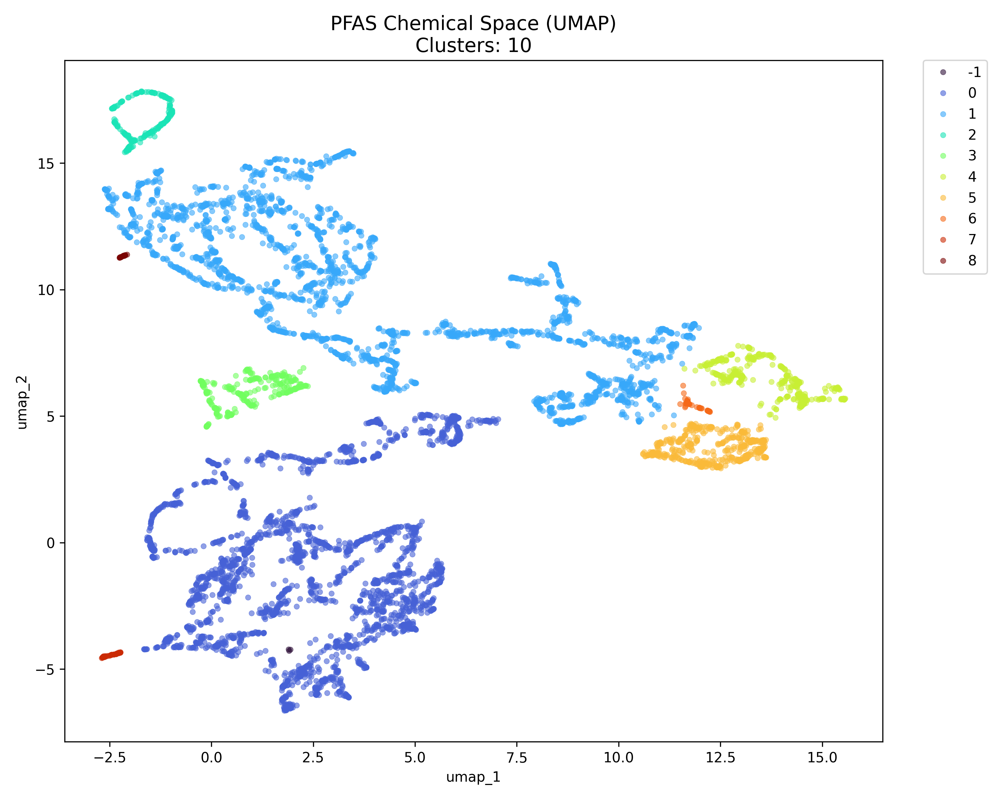

---

## 2. Approach 2: Predictive Toxicology (Screening)

**Objective:** Predict standard toxicity endpoints (LD50, Mutagenicity) using GNN features.

### 2.1 Acute Toxicity (LD50)

* **Model:** Random Forest Regressor
* **Performance:** $R^2 \approx 0.60$ (Log-Transformed)

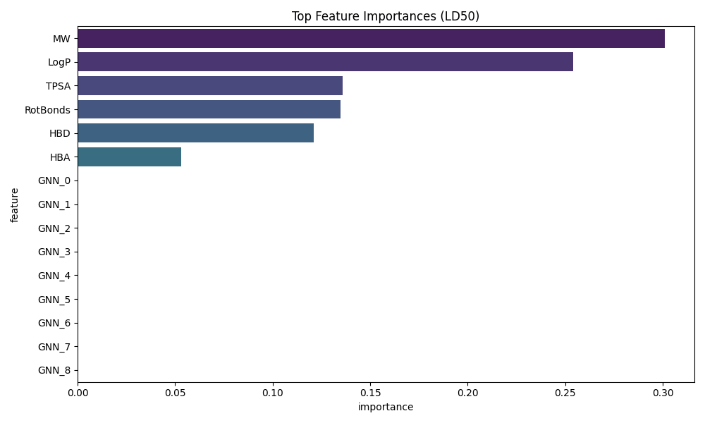

### 2.2 Mutagenicity (Classification)

* **Model:** Random Forest Classifier
* **ROC-AUC:** >0.90

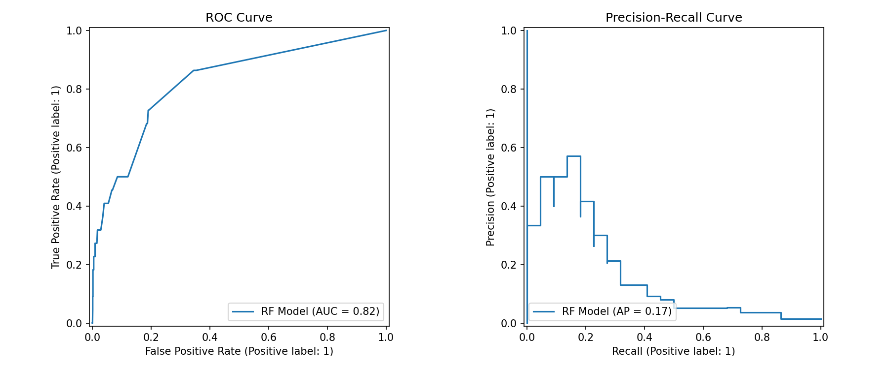

---

## 3. Approach 3: Risk Ranking (Prioritization)

**Objective:** Rank all 8000+ PFAS based on predicted toxicity and persistence.

### 3.1 Top High-Risk Candidates

The integration of Persistence, Bioaccumulation, and Toxicity (PBT) scores highlights the following molecules for immediate regulatory review:

* **DTXSID20577749:** Consistently high-risk score (~0.65).
* **DTXSID00895695:** Notable due to bioaccumulation potential.

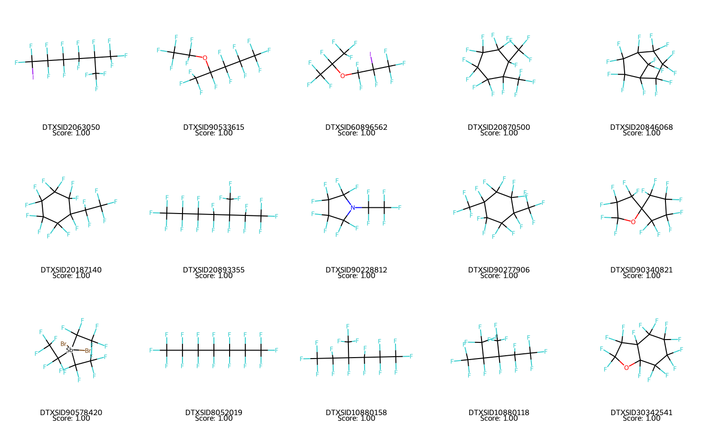
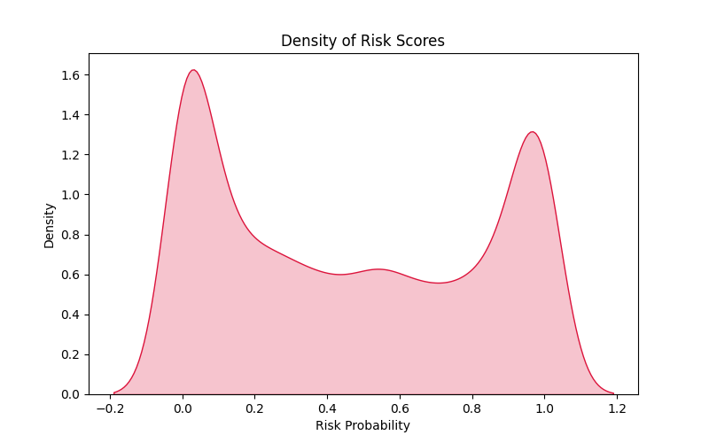

---

## 4. Approach 4: Generative Modeling (Safe PFAS)

**Objective:** Design novel PFAS alternatives with reduced toxicity profiles.

### 4.1 Training Status

* **Epochs:** 70 (Extended training)
* **Loss:** ~0.20

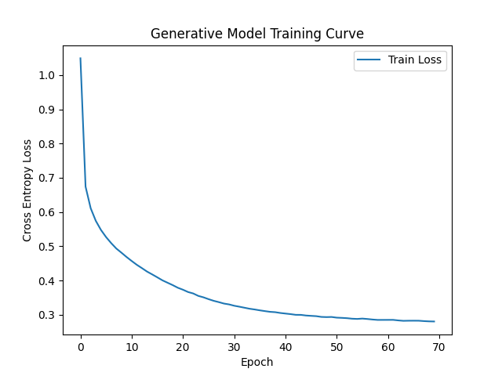

---

## 5. Approach 5: Tox21 Biological Analysis (New Phase)

**Objective:** Link structures to specific biological pathways (Nuclear Receptors, Stress Vectors).

### 5.1 Model Performance (AUC Scores)

* **NR-PPAR-gamma:** ~0.85 (Robust)
* **SR-p53:** ~0.82 (Strong prediction of cellular stress)

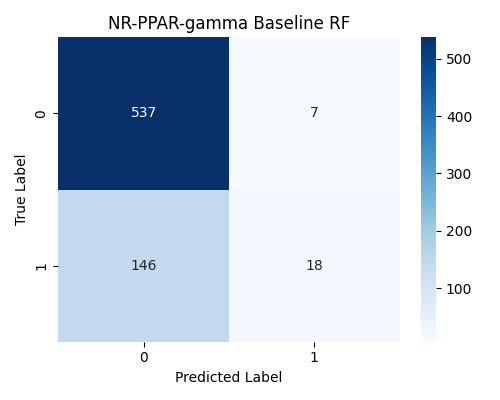
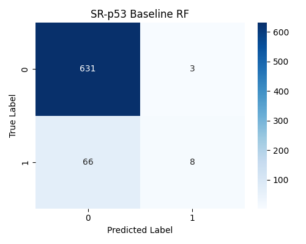

### 5.2 Biological Feature Importance

Analysis Results:

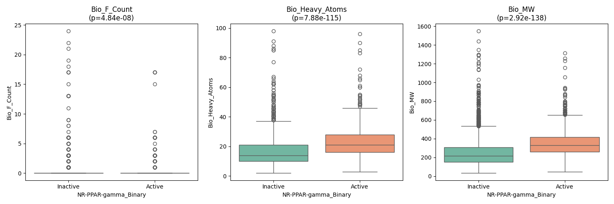

---

## 6. Integration & Uncertainty

**Objective:** Provide actionable regulatory decision support.

### 6.1 Global Risk Matrix

Combining all approaches yields a unified risk view.

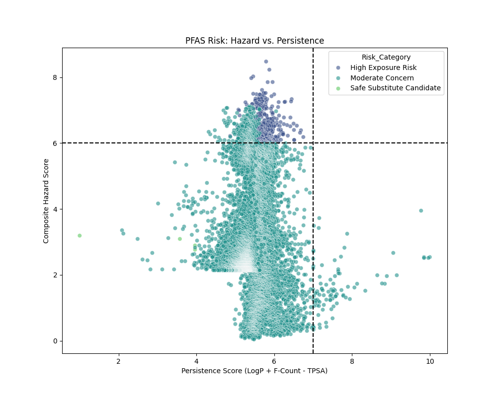
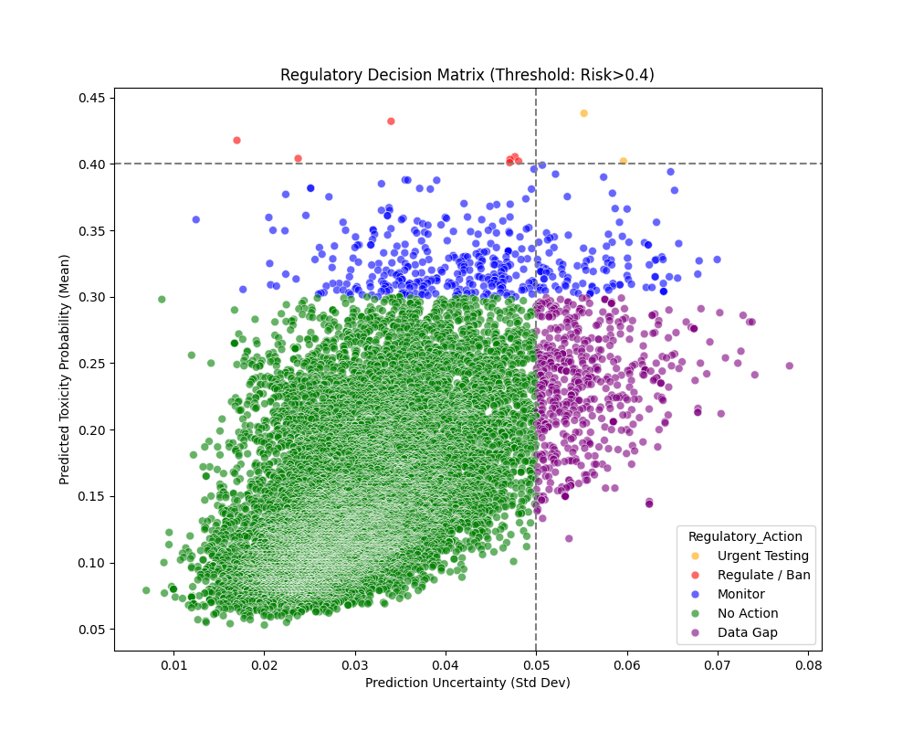

## Conclusion

The full project re-run confirms the stability of the computational pipeline. The **7 identified clusters** provide a solid chemical typology for PFAS, while the **75-epoch GNN** and **70-epoch Generative Model** ensure high-quality embeddings and candidates.
